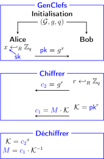

<div align="center">
  <h1>ElGamal</h1>
  
</div>

-----------------

A Python3 implementation of ElGamal encryption algorithm.

Here is the <a href="https://en.wikipedia.org/wiki/ElGamal_encryption">wikipedia</a> page of the algorithm where you can find an explanation on how this algorithm work.

### Public Key generation
```
alice = Elgamal()
alice_public_key = alice.publishPublicKey()
```
### Encryption
```
message = "Hello World !"
bob = Elgamal()
bob_cipher = bob.cipher(alice_public_key, message)
```
### Decryption
```    
alice_decrypted = alice.unCipher(bob_cipher)
```
### Attack
The problem of discrete logartihm is <a href="https://en.wikipedia.org/wiki/ElGamal_encryption">NP-Complete</a>, but if the random x picked is to small we can possibly guess the secret key in a reasonnable time. Worth give it a try !
```    
attackElGamal(public_key)
```
